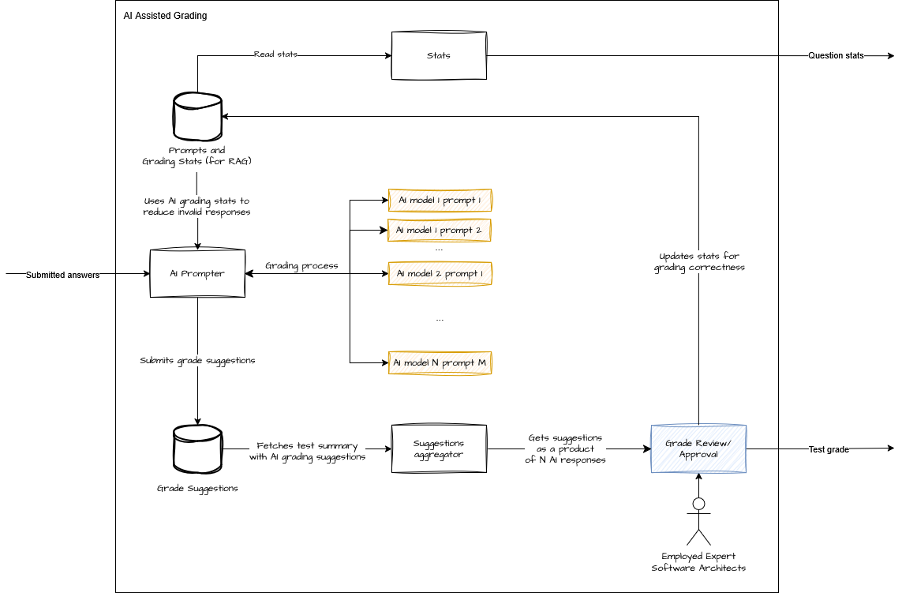

# 0001 Replace manual grading with AI assisted grading

## Context

There is an expected raise in the demand for architect certification as well as planned expansion to new markets. The forcasted numbers show that our current capability will soon be exhausted.
The analysis showing that can be found [here](../Feasibility%20Analysis.xlsx).  

This lead us to explore the possibilities of utilizing LLM services for the purpose of shortening the required time to grade an exam.

## Decision

We will extend the current manual grading step in both "Test 1" and "Test 2" scenarios. The system will still rely on human interaction to accept or review the score suggested by AI.
Because of the fact, that LLM's do not produce 100% accurate results, we will use strategies that will reduce the chance of a test being graded incorrectly.
The solution will work in the following manner:

## Consequences

With the aid of AI, we are going to signifficantly limit the time needed to grade both tests.
We are purposely leaving human actions as required, because for the moment, the results of AI interaction have a significant uncertainty factor
and due to the nature of our business we want to make sure, that the decision about granting or denying a certificate will be just and adhere to any laws on the subject.  

## Tradeoffs

By introducing AI into the process of assesing exams we loosen or relinquish control of quality and responsibility of the assesment.
Laws regarding consequences of AI being used in such cases are either non-existent or brand new so most likely, the percentage of appeals will rise.
At the same time, the system becomes more complicated and dependent on external vendors and the quality of their services.
