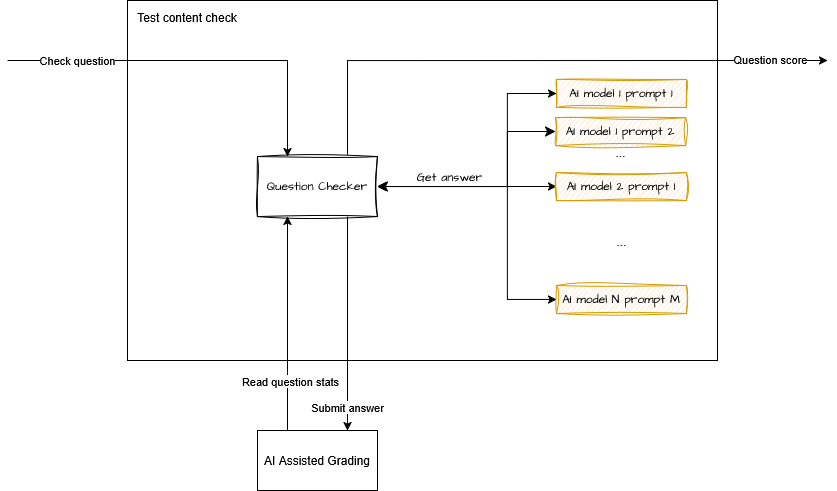

# 0011 AI-assisted cross check for test content updates

## Context

When we apply significant changes to the existing test or introduce a new one, it is crucial to ensure that the questions are clear and that the answers can be accurately assessed by our AI-assisted verification system. To achieve this, we propose a new feature where AI will be used to answer the test questions, and these answers will be fed into the existing AI-assisted assessment system. This process will provide our moderators with a clear indication of the clarity of the questions and the accuracy of the AI-assisted verification system.

## Decision

We will implement a Cross-AI Verification feature for new and significantly modified tests. This feature will involve using AI to generate answers for the test questions, which will then be assessed by our existing AI-assisted verification system. The results will help moderators determine the clarity of the questions and the effectiveness of the AI-assisted assessment system.

## Consequences

1. **Improved Clarity**: Moderators will receive clear indications on whether the test questions are understandable and unambiguous.
2. **Enhanced Accuracy**: By verifying the AI's ability to assess the generated answers, we can ensure that the AI-assisted verification system is functioning correctly and accurately.
3. **Efficiency**: Automating the initial verification process will save time for moderators, allowing them to focus on more other issues.
4. **Quality Assurance**: Continuous verification of new and modified tests will help maintain the quality and reliability of our assessments.
5. **Risk Management**: Identifying potential issues with test questions and the AI-assisted verification system early on, will help mitigate risks associated with incorrect assessments.

The process is still a manual one, though with additional data and possibility to check the potential answers on the fly, we're hoping to reduce the time spent on test moderation.
