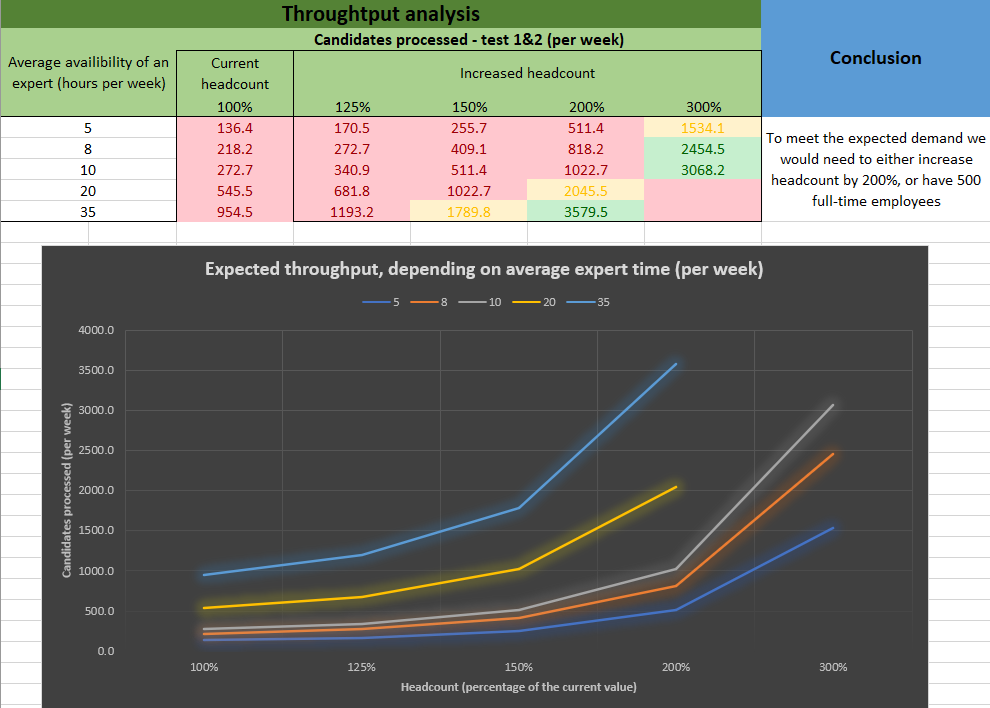
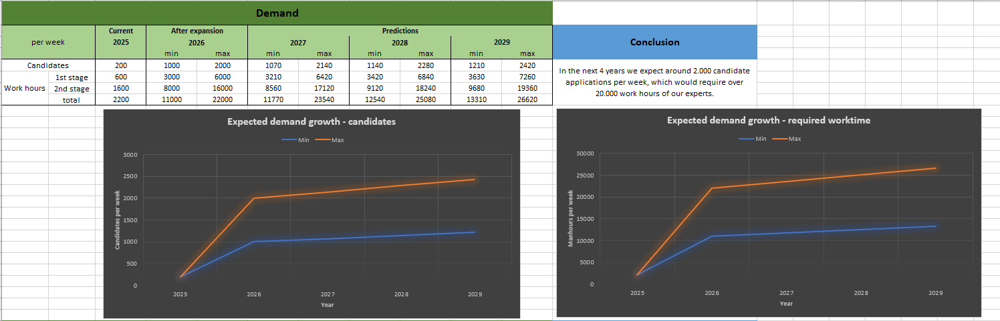
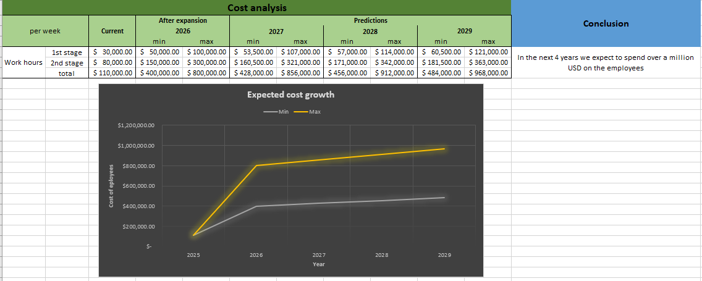

# Knowledge Out of Range Exception - O'Reilly Architectural Katas: Winter 2025

## 👥 Team

We are **Knowledge Out of Range Exception**, a group of passionate professionals from Endava Poland. Our team is consists of the following members:

- Paweł Wawrzynek
- Arkadiusz Jastrzębski
- Krzysztof Szczęsny

## 🎥 Video Presentation

**Embedded video here.**

## 📑 Table of Content

- [🤔 Problem Description](#-problem-description)
- [📊 Feasibility Analysis](#-feasibility-analysis)
- [📐 Architecture and Design](#-architecture-and-design)
- [✍️ Architecture Decision Records](#️-architecture-decision-records)

## 🤔 Problem Description

Certifiable, Inc. is facing a significant increase in demand for software architecture certifications due to new laws requiring such certifications and expansion to new markets. The company currently employs 300 expert software architects, with 5 designated experts authorized to modify certification tests. They handle around 200 candidates per week in the U.S., a number expected to grow 5-10 times with overseas expansion. The certification exam costs $800, a price fixed by the Software Architecture Licensing Board (SALB).

To manage this surge, the company consider redesign of their flagship system, SoftArchCert by incorporating Generative AI.

### Requirements

- Automate the certification process to handle increased volume.
- Maintain or improve the accuracy and reliability of the grading process.
- Reduce the workload on human graders while ensuring high standards.

## 📊 Feasibility Analysis

### Introduction

This feasibility analysis evaluates the potential benefits, challenges, and overall viability of incorporating AI into the certification process.

**Demand Growth:**

1. Expected demand for candidates without Generative AI is projected to increase significantly, reaching ~2 000 application per week by 2029.
2. Based on throughput analysis, to meet this demand without generative AI, the company must increase headcount by 200% or maintain a workforce of 500 full-time employees. 
See [ADR-001](./ADR/ADR%200001%20-%20Replace%20manual%20grading%20with%20AI%20assisted%20grading.md)

**Costs:**

1. The estimated costs for employee work hours without automation is projected to be near $1 million annually by 2029. (200% increase in headcount would triple workforce costs)
2. A significant rise in spending occurs immediately after expansion in 2026.
3. Recruiting and managing 500 full-time employees would require additional HR and infrastructure investment, further inflating expenses.

### Generative AI as cost-effective solution

AI-powered automation can significantly reduce the number of full-time employees needed, limiting headcount expansion while increasing processing capacity. Instead of hiring hundreds of new employees, existing staff can focus on human oversight over AI. With AI integration, the need for a 200% increase in workforce can be eliminated, leading to substantial cost savings.

### Benefits

1. **Scalability**: AI can handle a higher volume of certification requests without a proportional increase in human resources.
2. **Efficiency**: Automated grading can significantly reduce the time required to assess tests.
3. **Cost Savings**: Over time, the reduction in manual grading can lead to cost savings.

### Challenges

1. **Initial Investment**: Implementing AI solutions requires a significant upfront investment in technology and training.
   - **Mitigation**: Plan for phased implementation. Start with a pilot program to demonstrate value before scaling up.
2. **Model Accuracy**: Ensuring the AI models are accurate and reliable is critical. This requires continuous monitoring and updates.
   - **Mitigation**: Include human oversight over Generative AI to validate and correct AI outputs.
3. **Integration**: Integrating AI into the existing system may pose technical challenges and require substantial modifications.
   - **Mitigation**: Conduct thorough testing and have a dedicated integration team to manage the process. Use modular and scalable architecture to facilitate integration.
4. **User Training and Adoption**: Ensuring that staff are adequately trained to use AI tools and that they adopt the new technology.
   - **Mitigation**: Provide comprehensive training programs and ongoing support. Foster a culture of innovation and openness to new technologies.

### Financial Feasibility

1. **Cost-Benefit Analysis**: The long-term benefits of reduced manual grading costs and improved efficiency outweigh the initial investment.
2. **ROI**: A detailed return on investment (ROI) analysis indicates positive financial outcomes within a reasonable timeframe.

### Risk Analysis

1. **Technical Risks**: Potential issues with AI model accuracy, integration challenges, and system performance.
2. **Compliance Risks**: Ensuring adherence to regulatory requirements and maintaining transparency in the AI-assisted grading process.

### Conclusion

The feasibility analysis indicates that without AI, the company will struggle to scale efficiently due to the excessive workforce and financial demands. Integrating Generative AI into the SoftArchCert system is viable and offers significant benefits in terms of scalability, efficiency, and cost savings. While there are challenges and risks, they can be mitigated through careful planning, continuous monitoring, and a balanced approach to AI and human oversight. The proposed redesign will enable Certifiable, Inc. to manage the anticipated increase in certification requests effectively and maintain high standards in the certification process.

## 📐 Architecture and Design

## ✍️ Architecture Decision Records

### 1. Replace manual grading with AI-assisted grading
- [ADR 0001 - Replace manual grading with AI-assisted grading](./adr/0001-replace-manual-grading-with-ai-assisted-grading.md)

### 2. Selected models for AI-assisted grading
- [ADR 0002 - Selected models for AI-assisted grading](./adr/0002-selected-models-for-ai-assisted-grading.md)

### 3. Use multiple different prompts for obtaining AI grade
- [ADR 0003 - Use multiple different prompts for obtaining AI grade](./adr/0003-use-multiple-different-prompts-for-obtaining-ai-grade.md)

### 4. Aggregate Responses from Multiple Models
- [ADR 0004 - Aggregate Responses from Multiple Models](./adr/0004-aggregate-responses-from-multiple-models.md)

### 5. Use RAG
- [ADR 0005 - Use RAG](./adr/0005-use-rag.md)

### 6. AI Response Evaluation Process
- [ADR 0006 - AI Response Evaluation Process](./adr/0006-ai-response-evaluation-process.md)

### 7. Human Verification for AI Responses
- [ADR 0007 - Human Verification for AI Responses](./adr/0007-human-verification-for-ai-responses.md)

### 8. AI-only Test Resolution
- [ADR 0008 - AI-only Test Resolution](./adr/0008-ai-only-test-resolution.md)

### 9. Prompt Accuracy Monitoring
- [ADR 0009 - Prompt Accuracy Monitoring](./adr/0009-prompt-accuracy-monitoring.md)

### 10. AI-assisted Pass Rate Analysis
- [ADR 0010 - AI-assisted Pass Rate Analysis](./adr/0010-ai-assisted-pass-rate-analysis.md)

### 11. AI-assisted Cross Check for Test Content Updates
- [ADR 0011 - AI-assisted Cross Check for Test Content Updates](./adr/0011-ai-assisted-cross-check-for-test-content-updates.md)
