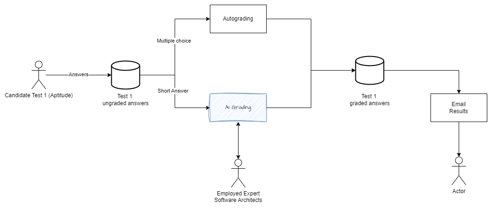
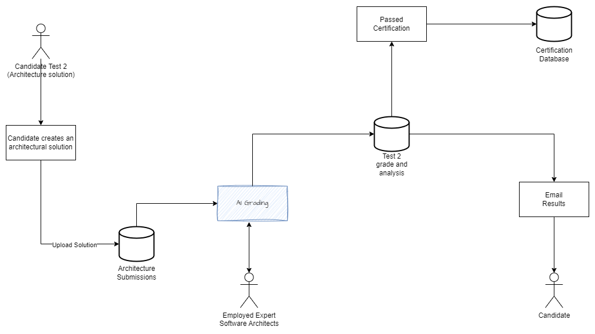

# KnowledgeOutOfRangeException - O'Reilly Architectural Katas: Winter 2025

## 👥 Team

We are KnowledgeOutOfRangeException!  
A group of passionate professionals from Endava Poland. Our team consists of the following members:  

||||
| :---: | :---: | :---: |
|Paweł Wawrzynek|Arkadiusz Jastrzębski|Krzysztof Szczęsny|

## 🎥 Video Presentation

**Embedded video here.**

## 📑 Table of Content

- [🤔 Problem Description](#-problem-description)
- [📊 Feasibility Analysis](#-feasibility-analysis)
- [📐 Architecture and Design](#-architecture-and-design)
- [✍️ Architecture Decision Records](#️-architecture-decision-records)

## 🤔 Problem Description 

Certifiable, Inc. is facing a significant increase in demand for software architecture certifications due to new regulations, as well as expansion to new markets. The company currently employs 300 expert software architects, with 5 designated experts authorized to modify certification tests. They handle around 200 candidates per week in the U.S., a number expected to grow 5-10 times with overseas expansion. The certification exam costs $800, a price fixed by the Software Architecture Licensing Board (SALB).

To manage this surge, the company is considering a redesign of their flagship system, SoftArchCert by incorporating Generative AI.

### Requirements

- Automate the certification process to handle increased volume.
- Maintain or improve the accuracy and reliability of the grading process.
- Reduce the workload on human graders while ensuring high standards.

## 📊 Feasibility Analysis

### Introduction

This feasibility analysis evaluates the potential benefits, challenges, and overall viability of incorporating AI into the certification process.

**Demand Growth:**

1. Expected demand for candidates without Generative AI is projected to increase significantly, reaching ~2 000 application per week by 2029.
2. Based on throughput analysis, to meet this demand without generative AI, the company must either increase the contractors' headcount by 200%, or employ them full-time and still extend from 300 to 500.
See [ADR-001](./resources/ADR/ADR%200001%20-%20Replace%20manual%20grading%20with%20AI%20assisted%20grading.md)

**Costs:**

1. The cost of employee labour, without automation, is estimated for around $1 million annually by 2029. (200% increase in headcount would triple workforce costs)
2. A significant rise in spending occurs immediately after expansion in 2026.
3. Recruiting and managing 500 full-time employees would require additional HR and infrastructure investment, further inflating expenses.

### Generative AI as cost-effective solution

AI-powered automation can significantly reduce the number of full-time employees needed, limiting headcount expansion while increasing processing capacity. Instead of hiring hundreds of new employees, existing staff can focus on human oversight over AI. With AI integration, the need for a 200% increase in workforce can be eliminated, leading to substantial cost savings.

### Benefits

1. **Scalability**: AI can handle a higher volume of certification requests without a proportional increase in human resources.
2. **Efficiency**: Automated grading can significantly reduce the time required to assess tests.
3. **Cost Savings**: Over time, the reduction in manual grading can lead to cost savings.

### Challenges

1. **Initial Investment**: Implementing AI solutions requires a significant upfront investment in technology and training.
   - **Mitigation**: Plan for phased implementation. Start with a pilot program to demonstrate value before scaling up.
2. **Model Accuracy**: Ensuring the AI models are accurate and reliable is critical. This requires continuous monitoring and updates.
   - **Mitigation**: Include human oversight over Generative AI to validate and correct AI outputs.
3. **Integration**: Integrating AI into the existing system may pose technical challenges and require substantial modifications.
   - **Mitigation**: Conduct thorough testing and have a dedicated integration team to manage the process. Use modular and scalable architecture to facilitate integration.
4. **User Training and Adoption**: Ensuring that staff are adequately trained to use AI tools and that they adopt the new technology.
   - **Mitigation**: Provide comprehensive training programs and ongoing support. Foster a culture of innovation and openness to new technologies.

### Risk Analysis

1. **Technical Risks**: Potential issues with AI model accuracy, integration challenges, and system performance.
2. **Compliance Risks**: Ensuring adherence to regulatory requirements and maintaining transparency in the AI-assisted grading process.

### Conclusion

The feasibility analysis indicates that without AI, the company will struggle to scale efficiently due to the excessive workforce and financial demands. Integrating Generative AI into the SoftArchCert system is viable and offers significant benefits in terms of scalability, efficiency, and cost savings. While there are challenges and risks, they can be mitigated through careful planning, continuous monitoring, and a balanced approach to AI and human oversight. The proposed redesign will enable Certifiable, Inc. to manage the anticipated increase in certification requests effectively and maintain high standards in the certification process.

## 📐 Architecture and Design

### Test 1 Architecture

The architecture diagram illustrates the automated grading process for Test 1. It shows high overview of how responses are processed and graded.

- Candidate complete Test 1, consisting of multiple-choice and short-answer questions.
- Responses are stored in a database as ungraded answer
- Multiple-choice questions are graded through an auto-grading system. **No impact on the current process**
- Short-answer responses are passed to an [AI Grading](#grading-component) for evaluation. **Human grading process is replaced by new AI Grading**
- System compiles all graded responses and stores them in a database
- Candidates are notified via email.

### Test 2 Architecture

Test 2 is designed to assess candidates ability to create an architectural solution. Suggested approach modifies the current process by adding evaluation based on [AI Grading](#grading-component)

- Candidate completes Test 2 by designing an architectural solution
- Solution is uploaded to the Architectural Submissions Database
- AI analyzes the submission using predefined evaluation criteria such as design quality, correctness, etc.
- AI assigns an initial grade and feedback 
- Expert reviews the submission. Hybrid approach ensures quality control while minimizing manual effort.
- Test 2 grading results are stored
- If candidate passes, their certification status is updated in the Certification Database
- Candidate receives his final result via email.

### Grading Component Architecture

The AI-Assisted Grading is designed to automate and enhance the grading process by leveraging multiple AI models. This system reduces expert workload.

- Candidate answers are fed into the AI Prompter.
- AI Prompter formulates queries and requests grading suggestions from multiple AI Models, each with multiple different prompts. Responses are evaluated independently.
- Results are aggregated to generate a final grading suggestion
- Expert reviews and adjusts AI generated grades if necessary
- Suggestions aggregator is responsible for aggregating stored grades

#### Grading Process

- AI Prompter send `N` prompt to `M` AI Models
- Each model asynchronously send grade suggestion to AI Prompter
- AI Prompter is responsible for storing data in Grading Suggestion DB

## ✍️ Architecture Decision Records

#### [ADR 0001 - Replace manual grading with AI-assisted grading](./ADR/ADR%200001%20-%20Replace%20manual%20grading%20with%20AI%20assisted%20grading.md)

#### [ADR 0002 - Selected models for AI-assisted grading](./ADR/ADR%200002%20-%20Selected%20models%20for%20AI%20asssisted%20grading.md)

#### [ADR 0003 - Use multiple different prompts for obtaining AI grade](./ADR/ADR%200003%20-%20Use%20multiple%20different%20prompts%20for%20obtaining%20AI%20grade.md)

#### [ADR 0004 - Aggregate Responses from Multiple Models](./ADR/ADR%200004%20-%20Aggregate%20Responses%20from%20Multiple%20Models.md)

#### [ADR 0005 - Use RAG](./ADR/ADR%200005%20-%20Use%20RAG.md)

#### [ADR 0006 - AI Response Evaluation Process](./ADR/ADR%200006%20-%20AI%20Response%20Evaluation%20Process.md)

#### [ADR 0007 - Human Verification for AI Responses](./ADR/ADR%200007%20-%20Human%20Verification%20for%20AI%20Responses.md)

#### [ADR 0008 - AI-only Test Resolution](./ADR/ADR%200008%20-%20AI-only%20Test%20Resolution.md)

#### [ADR 0009 - Prompt Accuracy Monitoring](./ADR/ADR%200009%20-%20Prompt%20accuracy%20monitoring.md)

#### [ADR 0010 - AI-assisted Pass Rate Analysis](./ADR/ADR%200010%20[out-of-scope]%20-%20AI-based%20Pass%20Rate%20Analysis.md)

#### [ADR 0011 - AI-assisted Cross Check for Test Content Updates](./ADR/ADR%200011%20[out-of-scope]%20-%20AI-assisted%20cross%20check%20for%20test%20content%20updates.md)
